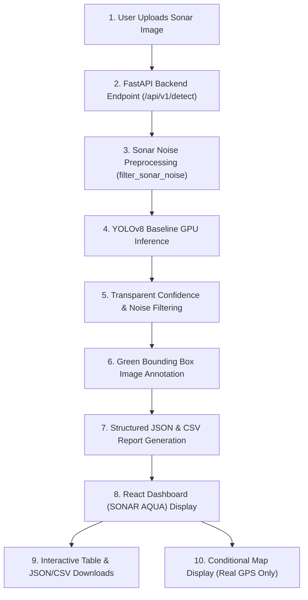

# SONAR AQUA — Internal Hackathon Demo Guide

> **Project:** SIH26057 — Marine Debris & Anomaly Detection MVP
> **Version:** 1.0.0 (Internal Hackathon Prototype)

---

## 1. Demo Architecture & Workflow

The **SONAR AQUA** vertical slice provides an end-to-end marine debris detection, noise filtering, report generation, and interactive telemetry dashboard.



---

## 2. Step-by-Step Demo Flow

1. **Launch Sonar Aqua:** Open the web interface at `http://localhost:5173`.
2. **Upload Sonar Image:** Drag and drop or browse a side-scan sonar image (`.jpg`, `.png`, `.tif`). Optionally attach navigation metadata (`.json`, `.csv`, `.xtf`).
3. **Set Confidence Threshold:** Adjust the post-processing confidence slider (default `0.25`).
4. **Backend Processing:**
   - **Preprocessing:** Bilateral filtering and attenuation correction are applied (`ml/src/preprocess_sonar.py`).
   - **Inference:** YOLOv8 baseline model (`ghost_pot_yolov8n_baseline/weights/best.pt`) runs object detection.
   - **Noise Filtering:** Transparent post-processing rejects low-confidence predictions or extreme image artifacts.
   - **Annotation:** Green bounding boxes and confidence pill badges are rendered directly on the output image.
5. **Dashboard Display:**
   - **Annotated Sonar Stage:** High-contrast display with green detection boxes and class labels (`Crab Pot`).
   - **Filtering Statistics:** View total raw detections vs. filtered anomalies vs. noise reduction count.
   - **Detected Anomalies Table:** Displays Class, Confidence %, Bounding Box Coordinates $(x_1, y_1, x_2, y_2, W, H)$, and Geolocation Status.
6. **Download Reports:**
   - Click `[ Download JSON ]` for full structured JSON telemetry.
   - Click `[ Download CSV ]` for tabular CSV report containing exact coordinates and metadata.
7. **GIS Map View:**
   - If real GPS coordinates exist in metadata, Leaflet map displays exact anomaly pins.
   - If metadata is unavailable, displays:
     `"Map unavailable — sonar metadata does not contain geolocation."`
     *(Coordinates are strictly extracted from real navigation headers; fake coordinates are never created).*

---

## 3. How to Run Locally

### Start Backend (FastAPI)
```powershell
python -m uvicorn app.main:app --host 127.0.0.1 --port 8000 --reload
```
- API Docs: `http://127.0.0.1:8000/docs`
- Health Endpoint: `http://127.0.0.1:8000/health`

### Start Frontend (Vite + React)
```powershell
cd frontend
npm run dev
```
- Web Application: `http://localhost:5173`

---

## 4. Verification Test Suite

Run the full automated test suite covering all 5 core MVP test cases:
```powershell
python -m pytest backend/tests
```
**Results:** `25 passed in 10.55s`

Run the live end-to-end integration script on a real raw sonar test image:
```powershell
python ml/src/test_live_e2e_demo.py
```
